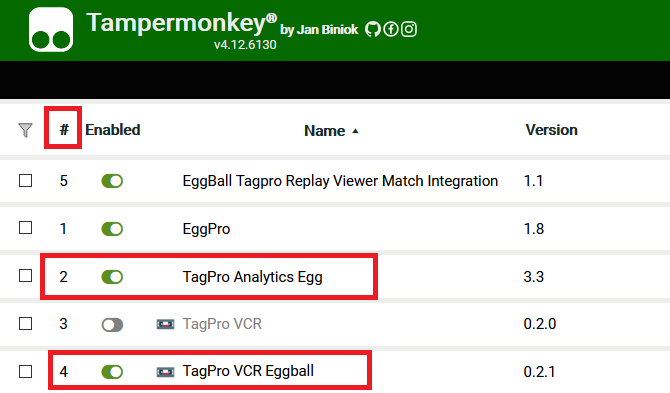
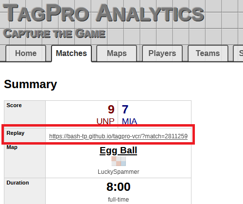

# Instructions on how to Auto-Upload Tagpro Replays to Cloud.

**Prerequisites:**
You must download Tampermonkey add-on for your browser first. It just takes ~2 minutes to setup both auto-upload and enhanced replay watching.

**Scripts**
There are two scripts needed to upload your replays.

1. Tagpro Analytics updated script: https://res.cloudinary.com/eggball/raw/upload/v1613667826/scripts/TagPro_Analytics_Egg.user.js
2. Tagpro VCR updated script: https://res.cloudinary.com/eggball/raw/upload/v1613667826/scripts/TagPro_VCR_Eggball.user.js

The analytics script was updated so the match ID is saved off. The VCR script was updated to save off the replay and upload it to cloudinary with the ID of the Match ID from Analytics site.

**Important:** You should turn off your current tagpro analytics script and VCR script so you're not duplicating scripts doing the same thing. I renamed the scripts so they will not override your current scipts when downloaded. The analytics script and VCR will continue to behave the same way as before, but were just enhanced/updated. You also need to ensure that the Tagpro Analytics script has a higher priority (lower #) than the VCR script. This way the Analytics script can send the match ID correctly to the VCR script. This should be the default behavior if the scripts are downloaded in the correct order.

**Important:** You must WAIT when the game is over for a few seconds until the "Match ID" is determined by Tagpro EU. Typically happens within a second unless you joined the game late. The Match ID shows up at the bottom of the stats at the end of the game. Once that match ID is determined, you can leave the game. If you leave beforehand, game will not be auto-uploaded.

**Watching Replays**
To watch the replay, install this script:
* https://res.cloudinary.com/eggball/raw/upload/v1613958893/scripts/EggBall_Tagpro_Replay_Viewer_Match_Integration.user.js
This script allows you to just enter the match ID within the VCR site - https://bash-tp.github.io/tagpro-vcr/ . It also allows you to Rewind and Record games/replays. Additionally with this script installed, you can jump to a replay directly from the Tagpro.eu website assuming that replay was auto-uploaded from the scripts above. No having to download replay files anymore. You can also share the link to your replay you have uploaded with others as long as they have the Replay Viewer script! Example:

